# Yang-Lee Edge singularity and <!-- .element: class="r-fit-text" -->

# and the structure of QCD phase diagram <!-- .element: class="r-fit-text" -->

Vladi Skokov

North Carolina state University

---

### QCD Phase diagram

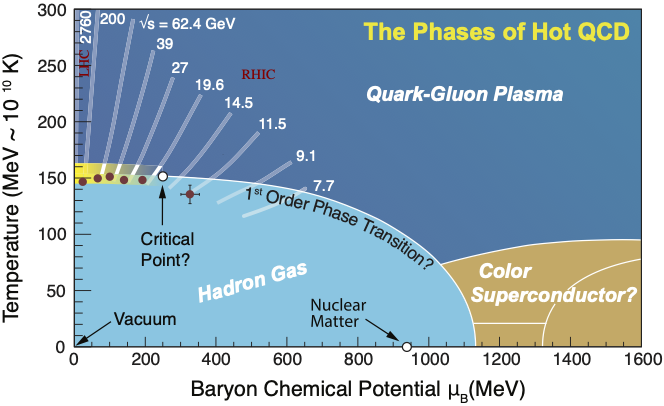

- Experiment with relativistic heavy ions: the system is small and has a short
  lifetime
- Theory: although the underlying theory (QCD) is known, we cannot solve it
  &cross;
- Numerical methods: zero density region only due to the ``sign'' problem
  &cross;
- Indirect methods: Taylor series coefficients/imaginary $\mu$ $\to$ non-zero
  baryon density &check;

`\[  p/T^4 = \sum_{n=0}^{\infty} \frac{  \chi_n }{n!}\left(\frac{\mu}{T}\right)^n;  \quad  \chi_n = \frac{ \partial^n(p/T^4)} { \partial\ (\mu/T)^n}  \quad     {\color{gray}  \chi_2 =  \frac{ \langle (\delta N)^2 \rangle   }{VT^3}     \quad   \chi_4 = \frac{ \langle (\delta N)^4 \rangle  -  3 \langle (\delta N)^2 \rangle^2  }{VT^3}}  \]`

---

### Taylor series expansion

- Consider an arbitrary function expanded around a regular point
  $$f(x) = \sum_{n=0}^{\infty} \frac{1}{n!}  f_n x^{n}$$
- What limits the predictive power of this expansion?

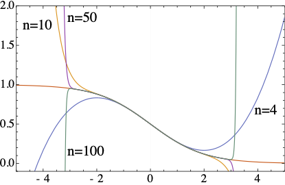

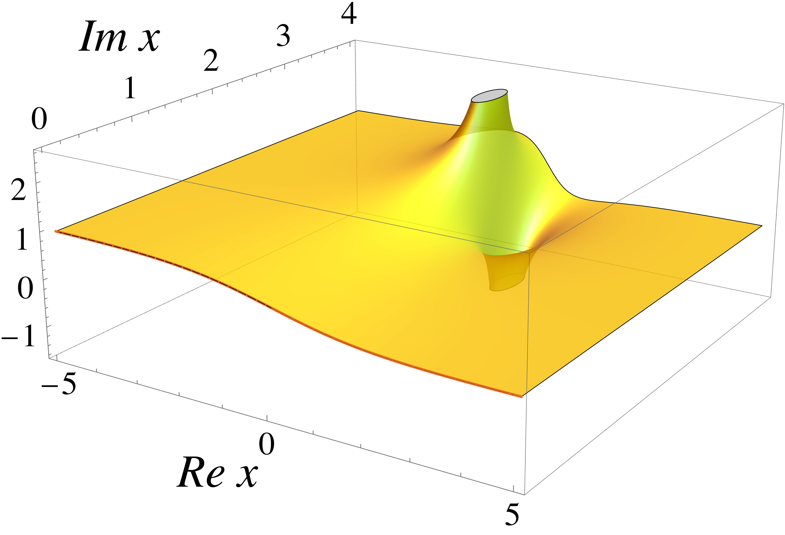

$$|x| < R_c \equiv \left(  \lim_n \sup \left| f_n^{1/n} \right| \right)^{-1}$$

- $R_c$ is the radius of convergence
- $R_c =$ distance in the _complex_ plane from the expansion point to the
  nearest singularity

---

### Are there singularities associated with critical point/phase transitions?

---

### Example: Landau free energy

`\[ F = \int d^{d} x \left(  \frac{1}{2} t \phi^2 + \frac{1}{4}  \lambda \phi^4 - h \phi   \right) \]`

Parameters can be:

- near chiral limit: $t \propto T-T_c + \kappa \mu^2$, $h\propto m_{u,d}$
- near CP: $t,h \propto \alpha_{t,h}(T-T_c) + \beta_{t,h} (\mu-\mu_c)$
- near RW: $t \propto T-T_{RW}$, $h\propto \mu_B - i \pi T$

--

### Vary $h$

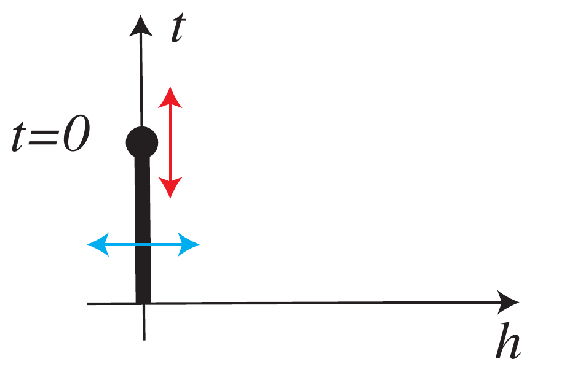
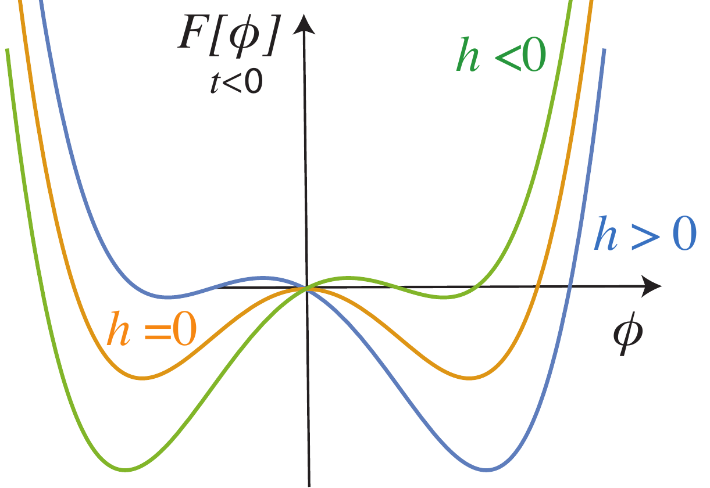

--

### Vary $t$

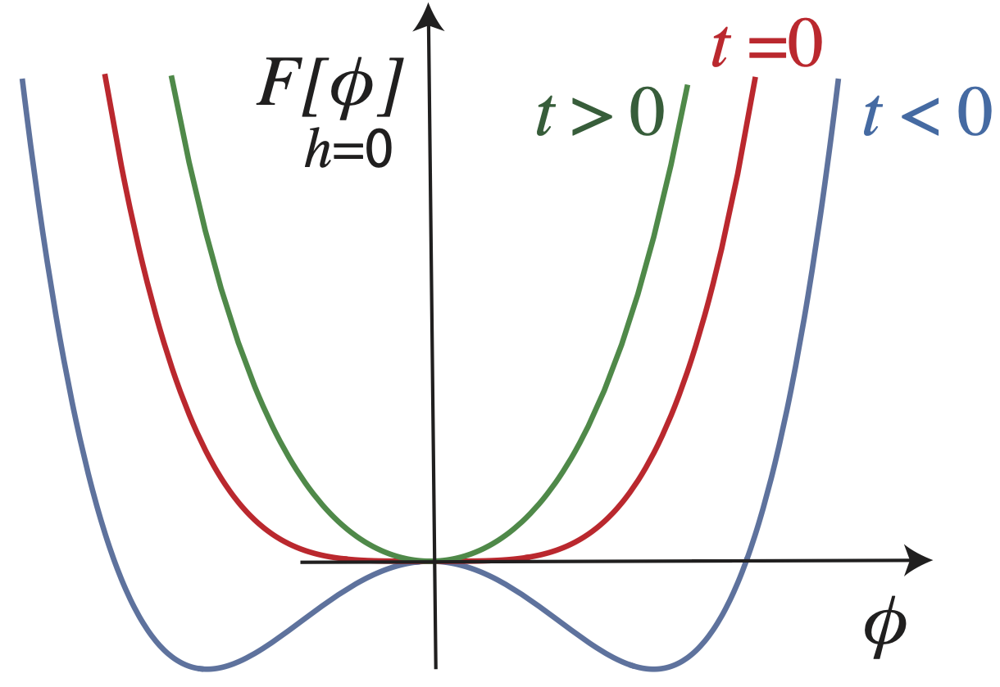

--

### Magnetic equation of state

`\[ F = \int d^{d} x \left(  \frac{1}{2} t \phi^2 + \frac{1}{4}  \lambda \phi^4 - h \phi   \right) \]`

Minimize $F[\phi]$ $\leadsto$ equilibrium order parameter:

- Arbirary $t$ and $h$: $t \phi + \lambda \phi^3 = h$
- Simplify $\lambda\to1$: $t \phi + \phi^3 = h$
- Ansatz for the solution $\phi = h^{1/3} f_G$

$t h^{1/3} f_G  + h f_G^3 = h$ or
${ \color{red}{\frac{t}{ h^{2/3}}} } f_G  + f_G^3 = 1$

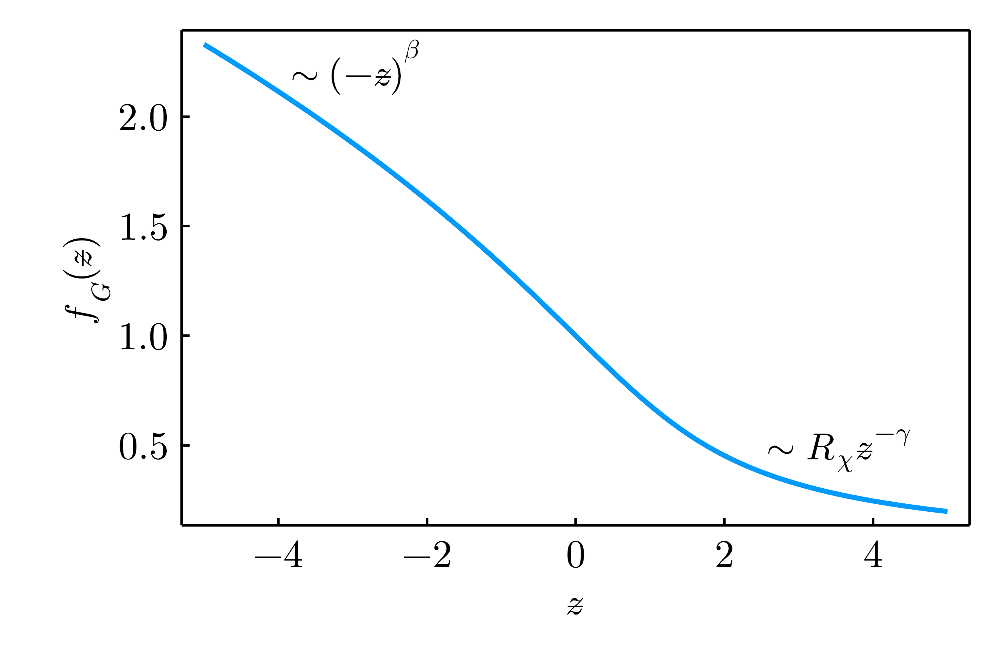

- Scaling form of "magnetic equation of state"
  $$f_G ( {\color{red}{z}}  + f_G^2) = 1, \quad {\color{red}{ z  =  {\frac{t}{ h^{\frac1{\beta \delta}} }} } } \quad\text{with} \quad  \beta = 1/2, \delta=3$$

--

### Yang-Lee edge singularity

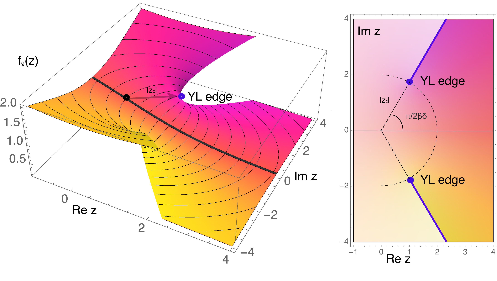

--

### Yang-Lee edge singularity

- To locate YLE: $$\frac{\partial^2 F}{\partial \phi^2} = 0  $$
- Equivalently:
  $$\frac{\partial  z}{\partial f_G} = 0  \leadsto z + 3 f_G^2 =0  $$
- Together with $f_G(z+f_G^2) = 1$ this defines the position $z_c$

--

### Near YLE singularity

- $f_G$ is singular
  $$f_G - f_G^c \propto (z-z_c)^{\color{red}{\sigma_{\rm YLE}}} $$

- The critical exponent ${\color{red}{\sigma_{\rm YLE}}}$ is independent of the
  underlying universality class

- From conformal bootrstrap, $\color{red}{\sigma^{d=3}_{\rm YLE}} = 0.085(1)$

- In a finite volume, $\sigma_{\rm YLE}$ describes scaling of the density of the
  Lee-Yang zeros

- Mean-field approximation gets it wrong:
  ${\sigma^{\rm MF}_{\rm YLE}} = \frac12$

- Not surprisingly, mean-field gets $z_c$ wrong as well

- $z_c$ is universal: for $O(N)$, $z_c$ depends only on $N$ and $d$

---

| Type of critical point:       | 
 protocritical = YLE 
 | critical | tricritical |
| ----------------------------- | ----------------------------------------------------------------------------- | -------- | ----------- |
| Number of relevant variables: | 
 1 
                   | 2        | 4           |

 
 1 independent crit. exp., c.f.  standard critical point with 2 independent crit. exp. 

--

### Illustration in Ising model

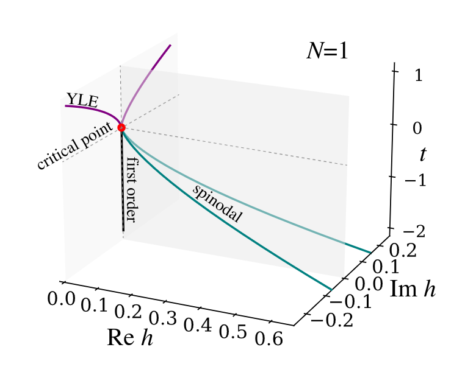

F. Rennecke, G. Johnson, and V.S.,     Phys.Rev.D 107 (2023) 11, 116013

- In contrast to the critical point, YLE form lines
- YLE are continuously connected to critical point

---

### Universal location of YLE

- The phase of $z_c = |z_c| e^{\pm \frac{i \pi}{\beta \delta}}$ is defined by
  the critical exponents of the underlying universality class. How to find
  $|z_c|$?
- Ordinary, we rely on two methods: $\varepsilon$-expansion and lattice

  - $\varepsilon$-expansion breaks down: YLE is described by $\phi^3$ with upper
    critical dimension $d_c=6$, while underlying universality class has $d_c=4$
    
 M. Fisher, “Yang-Lee Edge Singularity and φ3 Field Theory”, Phys. Rev. Lett. 40 1610 (1978) 

    

    Only leading order under perturbative control

    $$
    |z_c| \approx  |z_c^{\rm MF}| \left[1 +  \frac{ 27 \ln \left(\frac{3}{2}\right) -  (N-1)  \ln 2}{9
    (N+8)}\epsilon \right] + \epsilon^2 \log \epsilon \times  ( \cdots ) .
    $$

    

  - lattice: direct calculations at complex values of parameters are impossible
    due to sign problem; indirectly lattice can provide information about YLE
    location through calculations at real values of thermodynamic parameters
    
 Schmidt, Karsch 

- Functional Renormalization group provides most precise $|z_c|$ in $d=3$

---

### Functional/Exact Renormalization Group

- Start with bare classical action at small distances/large momentum
  $S_{k=\Lambda}$
- Gradually include fluctuations of larger size/smaller momentum
- Continue until fluctuations of all possible sizes/momenta are accounted for

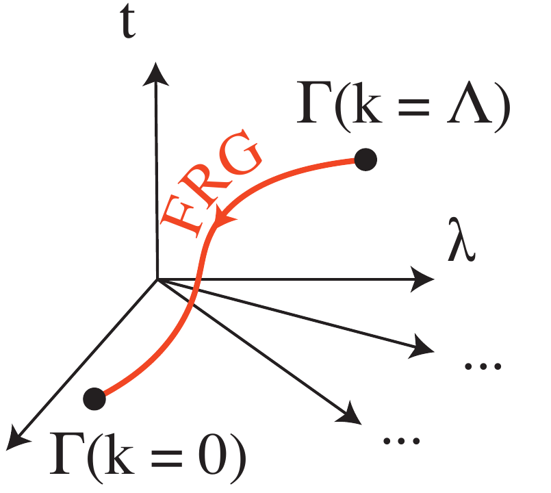

- Equation that does it: Functional Renormalization Group equation
  $$
  \partial_k \Gamma_{k}[\phi] = \frac{1}{2} {\rm STr} \Big[ \big( \Gamma^{(2)}_{k}[\phi] + R_k \big)^{-1} \cdot \partial_k R_k  \Big]
  $$

 Wetterich, 1993

**Pros:** Exact, non-perturbative, no sign problem. **Cons**: requires
truncation.

---

### Truncation: derivative expansion

- Near critical point: long wave excitations $\leadsto$ expansion around the
  uniform field

- First-order derivative expansion

  $$
  \begin{aligned}
       \notag
       \Gamma_k[\phi] = \int d^d x \left( U_k(\phi)  + \frac {1 } { 2 }  Z_k(\phi)  (\partial_i \phi)^2 \right)
       \end{aligned}
  $$

  - The average potential

  $$
  \begin{aligned}
           \partial_t U_k(\rho) &= \frac{1}{2} \int \bar d^dq   \partial_t R_k\left(q^2\right) \Big[G_k^\parallel+(N-1) G_k^\perp\Big], \quad \rho = \frac{\phi^2}{2}
       \end{aligned}
  $$

  with

  $$
  \begin{aligned}
       &G_k^{\perp} =  \frac{1}{Z_k^{\perp}(\rho)q^2 + U_k'(\rho) + R_k(q^2)}, \quad G_k^{\parallel} =  \frac{1}{Z_k^{\parallel}(\rho)q^2 + U_k'(\rho)+2\rho U_k''(\rho) + R_k(q^2)}.
       \end{aligned}
  $$

---

### Truncation: derivative expansion

Wave function renormalization:

$$
\begin{aligned}
 \partial_t Z_{\parallel}(\phi) &= \int \bar d^d q \partial_t R_k(q^2) \Bigg\\{ G_\parallel^2 \Big[ \gamma_\parallel^2 \big(G_\parallel' + 2 G_\parallel'' \frac{q^2}{d}\big) 2 \gamma_\parallel Z_\parallel'(\phi) \big(G_\parallel + 2 G_\parallel' \frac{q^2}{d}\big) \\\\
& + (Z_\parallel'(\phi))^2 G_\parallel \frac{q^2}{d} \frac12 Z''_\parallel(\phi) \Big]
\\\\ & + (N-1) G^2\_{\perp} \Big[ \gamma_\perp^2 \big(G_\perp' + 2 G_\perp'' \frac{q^2}{d}\big) 4 \gamma_\perp Z_\perp'(\phi)  G_\perp' \frac{q^2}{d} (Z_\perp'(\phi))^2 G_\perp \frac{q^2}{d}
\\\\ &+  2 \frac{Z_\parallel(\phi)-Z_\perp(\phi)}{\phi} \gamma_\perp G_\perp \frac12 \left(\frac{1}{\phi}Z'_\parallel(\phi) \frac{2}{\phi^2} (Z_\parallel-Z_\perp) \right) \Big] \Bigg\\}
\end{aligned}
$$

with
$
\gamma_\parallel = q^2 Z_\parallel'(\phi) + U^{(3)}(\phi),  \quad \gamma_\perp = q^2 Z_\perp'(\phi) + \frac{\partial}{\partial \phi} \left( \frac{1}{\phi}U' (\phi) \right), \quad G' = \frac{\partial G} {\partial q^2}, \ldots
$

G. Johnson, F. Rennecke, and V.S., Phys.Rev.D 107 (2023) 11,
116013

---

### Truncation: series expansion

- Taylor series expansion of $U_k(\phi)$ and $Z_k(\phi)$ (orders 12 and 6
  respectively)

  - Traditionally: expand near $k$-dependent minimum: $U_k'[\phi_k] = h =$
    const.

  - To locate YLE: expand near $U_k''[\phi_k] = m^2 \to 0$.

    $\leadsto$ $U_k'[\phi_k] = h_k \ne$ const

    $\leadsto$ Calculations in the broken phase are not feasible

- 18-26 coupled stiff differential equations

  - Mathematica to obtain equations (multiple Gb)

  - Implicit solvers for ODE's

  - Months on an HPC

---

### Results: importance of fluctuations ($N$=1)

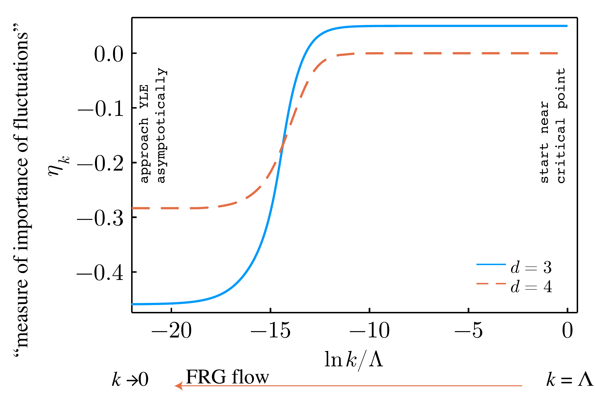

F. Rennecke and V. S, Annals Phys. 444 (2022) 169010

---

### Results: Ising universality class $N=1$

$d$ does not have to be integer in FRG

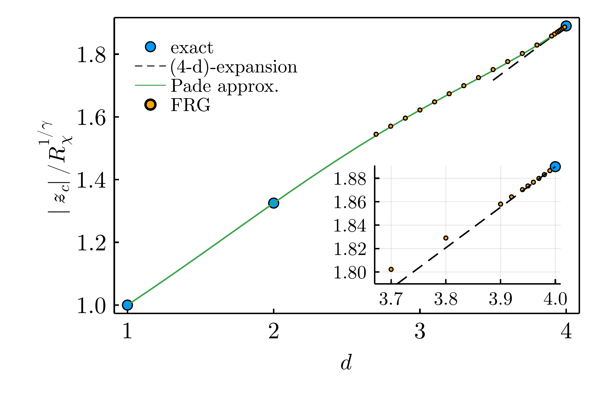

| d                                | 1   | 2          | 3        | 4           |
| -------------------------------- | --- | ---------- | -------- | ----------- |
| $ \| z_c \| /R\_\chi^{1/\gamma}$ | 1   | 1.32504(2) | 1.621(4) | $3/2^{2/3}$ |

G. Johnson, F. Rennecke, and V. S, Phys.Rev.D 107 (2023) 11,
116013  
F. Rennecke and V. S, Annals Phys. 444 (2022) 169010  
A. Connelly, G. Johnson, F. Rennecke, and V. S, Phys.Rev.Lett. 125 19, 191602
(2020)  
$d=2$: H.-L. Xu and A. Zamolodchikov, JHEP 08 (2022) 057 H.-L. Xu and A.
Zamolodchikov, 2304.07886

---

### Arbitrary $N$, $d=3$

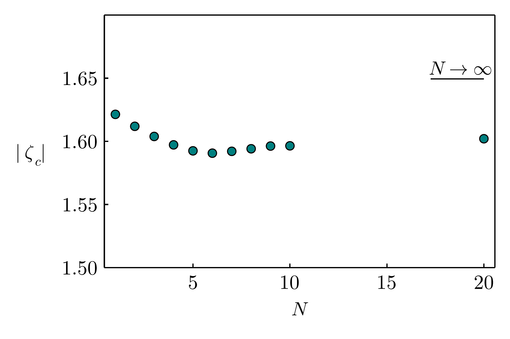

| N                                | 1           | 2           | 3           | 4           | 5            |
| -------------------------------- | ----------- | ----------- | ----------- | ----------- | ------------ |
| $ \| z_c \| /R\_\chi^{1/\gamma}$ | 1.621(4)(1) | 1.612(9)(0) | 1.604(7)(0) | 1.597(3)(0) | 1.5925(2)(1) |

G. Johnson, F. Rennecke, and V. S, Phys.Rev.D 107 (2023) 11,
116013  
c.f. F. Karsch, C. Schmidt, and S. Singh Phys.Rev.D 109 (2024) 1, 014508

---

### Is it useful for QCD?

- Tracing YLE singularity was shown to be useful

Indirect methods to locate YLE was used: input from Im $\mu$ or Taylor series
expansion coefficients of $\ln Z$ at zero $\mu$

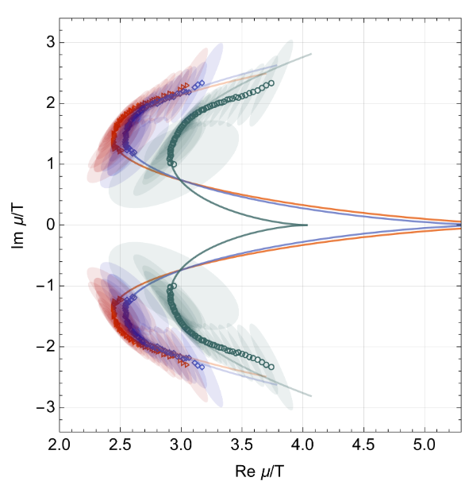
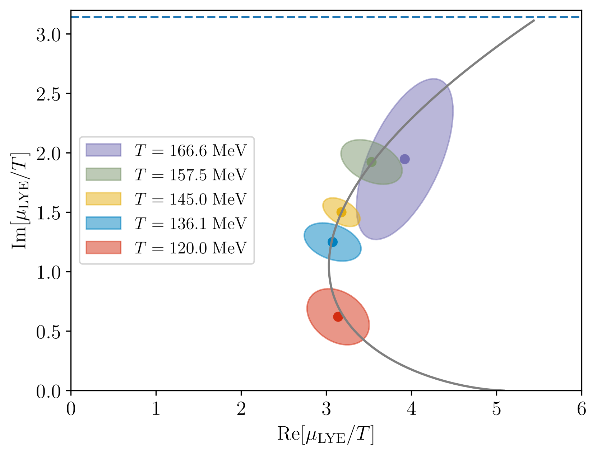

G. Basar, 2312.06952  
D. Clarke et. al., 2405.10196

C. Schmidt, CPOD 2024

--

### Is it useful for QCD?

- Properties of YLE, e.g. $\sigma_{\rm YLE}$ can be use to validate indirect
  methods of locating YLE in QCD, e.g. volume scaling of the density of zeros

- Moreover,

  - YLE defines the behavior of the higher order Taylor expansion coefficients
    (Darboux's theorem). E.g. for of $f_G(z)$:

    $$
    f_G^{(n)} \sim 2 B_0 {\red{|z_c|}}^{-n} \frac{n^{ \red \sigma -1 }}{\Gamma(\red \sigma  )}  \cos \left(\beta_0 - {\red{\frac{\pi n}{2\Delta}}  } \right),
    \quad B_0 \exp (i \beta_0) = \lim\limits_{z\to z_c}  \frac{ f_G(z)-f_G(z_c)}
    {(1-z/z_c)^{\sigma} }
    $$

  - Fourier coefficients are exponentially sensetive to YLE

    $$
    b_{k\gg1} \approx \|\tilde A_{\rm YLE}\| \frac{e^{-\hat \mu_r^{\rm YLE} k }}{k^{1+\sigma}} \cos(\hat \mu_i^{\rm YLE} k + \phi^{\rm YLE}_a)
    $$

    $$
     +\|\hat A_{\rm RW}\|  (-1)^k \frac{e^{-\hat \mu_r^{\rm RW} k }}{k^{1+\sigma}}
    $$

--

### Fourier coefficients

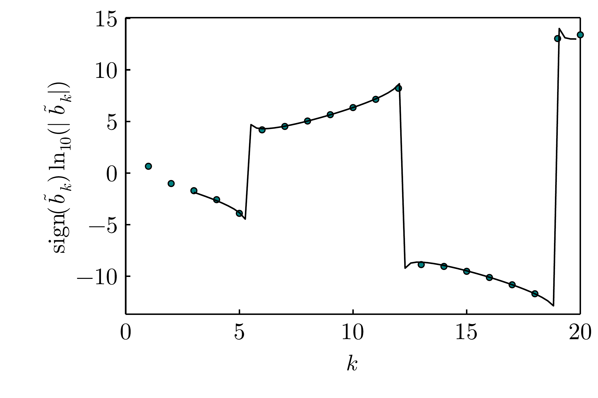

- Assymptotic expression captures behaviour of coefficients at rather small $k$
- Assymptotic formula as a fit function $\leadsto$ location of YLE

--

### Is it useful for QCD?

- $|z^{Z(2)}_c|$ was used by lattice QCD to establish scaling parameter near
  Roberge-Weiss critical point

K. Zambello et. al., 2301.03952

- Generically $|z_c|$ is useful only if the non-universal mapping parameters are
  known

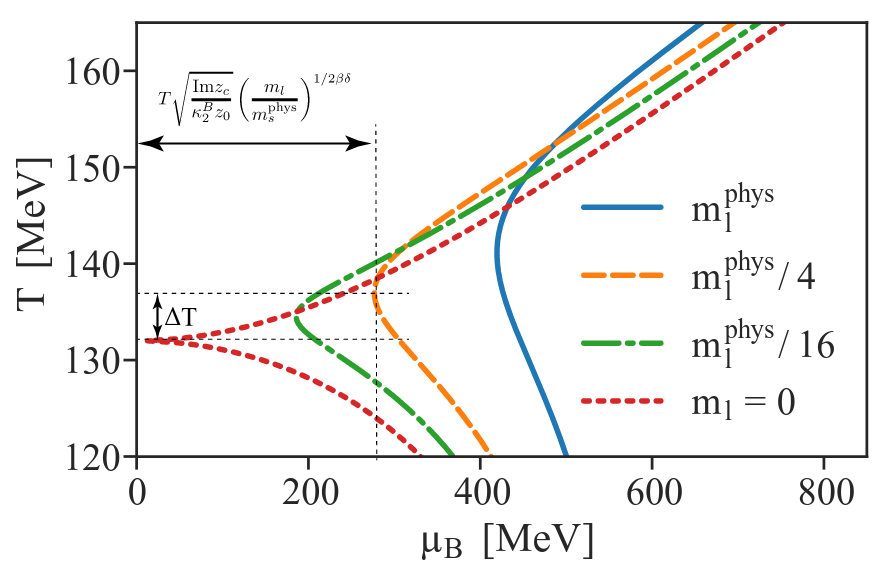

$\quad \frac{\Delta T}{T^0} = \frac{{\rm Re} z_c}{z_0} \left(
\frac{m_l}{m_s^{phys}}\right)^{\frac{1}{\beta \delta}} $

S. Mukherjee and V.S., 1909.04639

---

### Conclusions
