## Universal location of  

# Yang-Lee edge 

## singularity from Functional RG 

Vladi Skokov

North Carolina State University

---

## Outline

- Introduction: why analytic structure near second-order phase transition? 

- Introduction: Yang-Lee edge (YLE) singularity 

- Universal location of YLE for most relevant universality classes from FRG 

- What can we  learn about QCD critical point from YLE?  

- Conclusions 

---

### QCD Phase diagram

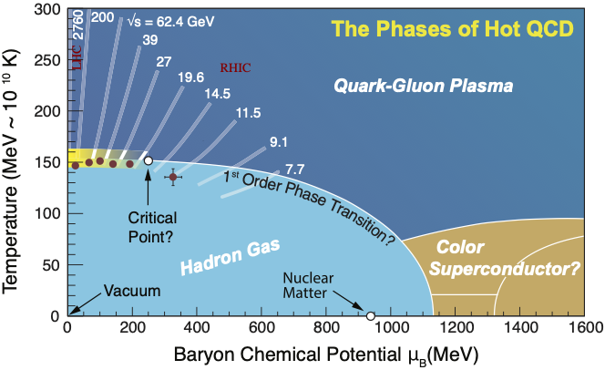

---
### Tracing singularity: QCD critical point  

Lattice input (Taylor series coeff.  at $\mu=0$ or  Im $\mu$) \&  analytic continuation 

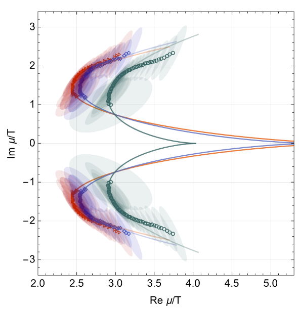
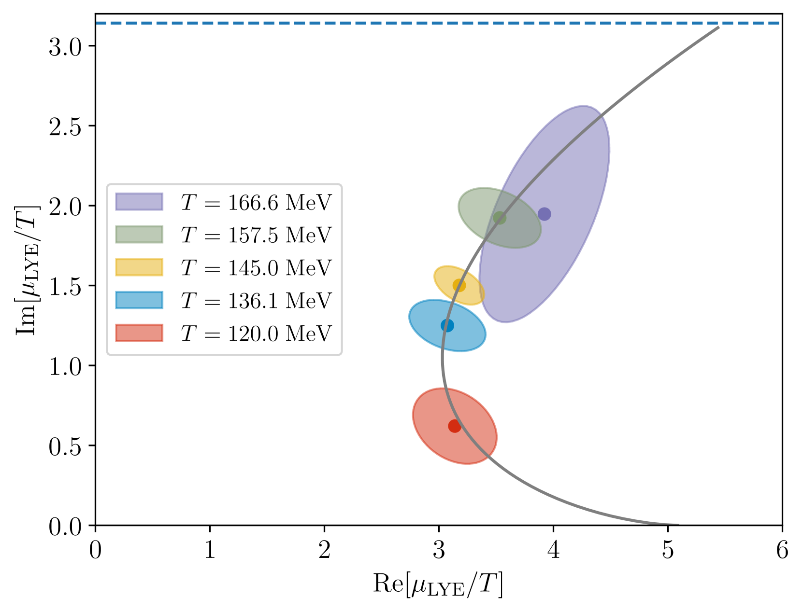

G. Basar, 2312.06952  
D. Clarke et. al., 2405.10196

$$
\leadsto 
T_c \approx 110 \text{ MeV} , \mu_c \approx 650 \text{ MeV } \text{in approximate agreement with FRG & DSE} 
$$ 

Wei-Jie Fu, J. Pawlowski,  and F. Rennecke, 1909.02991  
P. Isserstedt et. al., 1906.11644

---

### What are singularities associated with critical point/phase transitions?

---

### Toy model: Landau free energy

`\[ F = \int d^{d} x \left(  \frac{1}{2} t \phi^2 + \frac{1}{4}  \lambda \phi^4 - h \phi   \right) \]`

E.g.: 

- near chiral limit: $t \propto T-T_c + \kappa \mu^2$, $h\propto m_{u,d}$
- near CP: $t,h \propto \alpha_{t,h}(T-T_c) + \beta_{t,h} (\mu-\mu_c)$
- near RW: $t \propto T-T_{RW}$, $h\propto \mu_B - i \pi T$

---

### Vary $h$

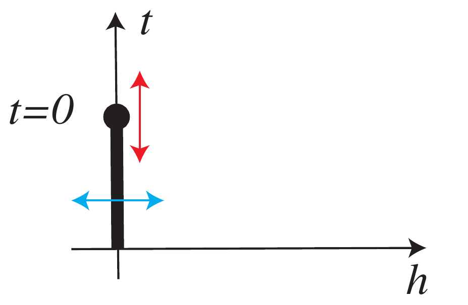
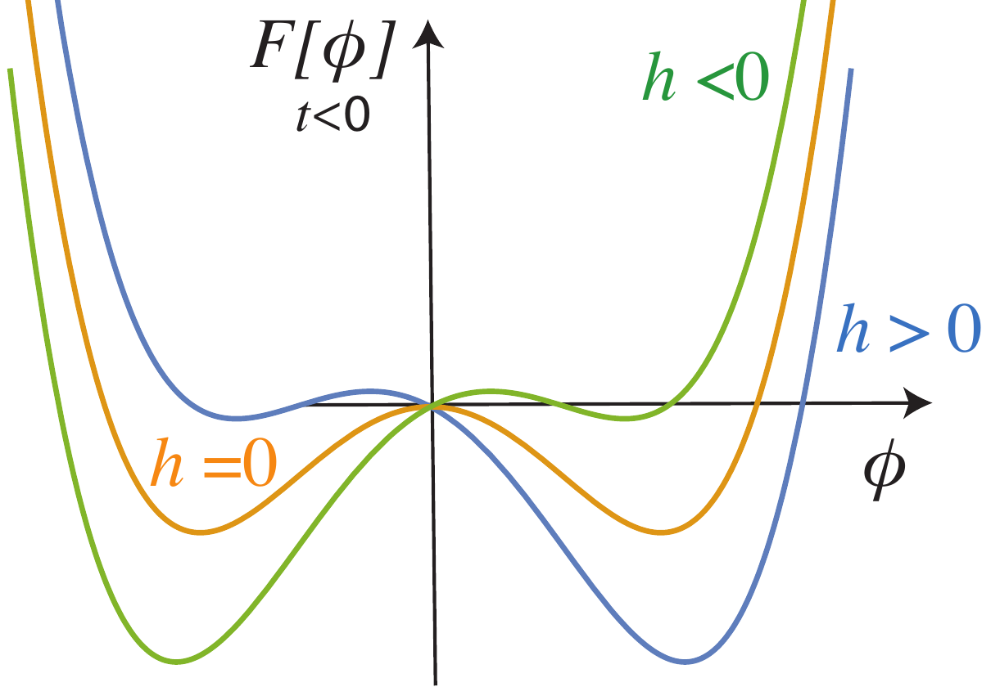

---

### Vary $t$

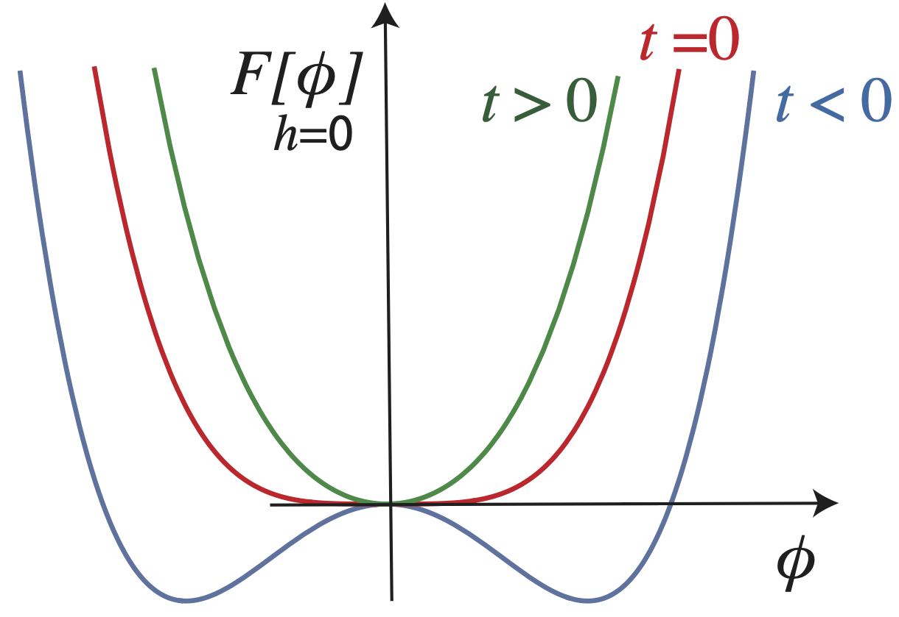

---

### Magnetic equation of state

`\[ F = \int d^{d} x \left(  \frac{1}{2} t \phi^2 + \frac{1}{4}  \lambda \phi^4 - h \phi   \right) \]`

- Minimize $F[\phi]$ $\leadsto$ equilibrium order parameter:

  

- Arbitrary $t$ and $h$: $t \phi + \lambda \phi^3 = h$
- To simplify math $\lambda\to1$: $t \phi + \phi^3 = h$
- Ansatz for the solution $\phi = h^{1/3} f_G$

$t h^{1/3} f_G  + h f_G^3 = h$ or
${ \color{red}{\frac{t}{ h^{2/3}}} } f_G  + f_G^3 = 1$

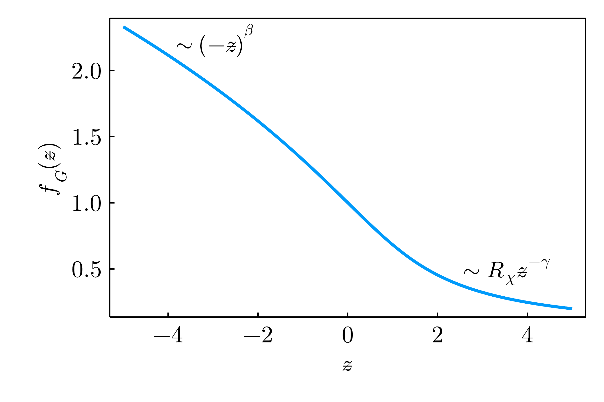

- Scaling form of the "magnetic equation of state"
  $$f_G ( {\color{red}{z}}  + f_G^2) = 1, \quad {\color{red}{ z  =  {\frac{t}{ h^{\frac1{\beta \delta}} }} } } \quad\text{with} \quad  \beta = 1/2, \delta=3$$

---

### Yang-Lee edge singularity

---

### Near YLE singularity: $\frac{\partial^2 F}{\partial \phi^2} = 0 $

- $f_G$ is singular
  $$f_G - f_G^c \propto (z-z_c)^{\color{red}{\sigma_{\rm YLE}}} $$

- Critical exponent ${\color{red}{\sigma_{\rm YLE}}}$ is independent of the
  underlying universality class

- From conformal bootrstrap, $\color{red}{\sigma^{d=3}_{\rm YLE}} = 0.085(1)$

- Mean-field approximation gets it wrong:
  ${\sigma^{\rm MF}_{\rm YLE}} = \frac12$

- One should not expect to mean field's $z_c$ to be a good approximation either  

- $z_c$ is universal: for $O(N)$, $z_c$ depends only on $N$ and $d$

---

| Type of critical point:       | 
 protocritical = YLE 
 | critical | tricritical |
| ----------------------------- | ----------------------------------------------------------------------------- | -------- | ----------- |
| Number of relevant variables: | 
 1 
 &nbsp;            | 2        | 4           |

 
 1 independent crit. exp., c.f.  standard critical point with 2 independent crit. exp. 

---

### Illustration in Ising model: $h_c(t) = i |z_c|^{-\beta \delta} t^{\beta \delta}$  

F. Rennecke, G. Johnson, and V.S.,     Phys.Rev.D 107 (2023) 11, 116013

- In contrast to the critical point, YLEs form lines
- YLEs are continuously connected to critical point

---

### Do YLEs always connect to finite $T$ crit. points? 

Counter example: one dimensional Ising model ($\hat h = h/T$, $\hat J = J /T$) 

$$ 
      f = - \lim_{L\to \infty} \frac{T}{L} \ln Z = -  T \ln \left( e^{\hat J} \cosh(\hat h) + \sqrt{ e^{2\hat J} \sinh^2(\hat h) + e^{-2\hat J}  } \right), 
$$ 

with YLE at 

$$
    h_c = \pm i T \arcsin e^{-2\hat J}
$$

Two YLEs pinch the real $h$ axis at $T=0$ 

---

### Universal location of YLE

- The phase of $z_c = |z_c| e^{\pm \frac{i \pi}{2 \beta \delta}}$ is defined by
  the critical exponents of the underlying universality class.  How to determine $|z_c|$?  
- Ordinary, two methods: $\varepsilon$-expansion and lattice

  - $\varepsilon$-expansion: 
    

    $$
      \beta = \frac{1}{2} + \frac{1}{6} \varepsilon  + \frac{1}{162} \varepsilon^2 + \frac{1}{2} \left( \frac{163}{8748} - \frac{2}{27} \zeta(3) \right) \varepsilon^3 + {\cal O}(\varepsilon^4), \quad \epsilon = 4 - d 
    $$
    

    YLE is described by $\phi^3$ with upper
    critical dimension $d_c=6$, while underlying universality class has $d_c=4$
    
 M. Fisher, “Yang-Lee Edge Singularity and φ3 Field Theory”, Phys. Rev. Lett. 40 1610 (1978) 

    

    Only leading order under perturbative control

    $$
    |z_c| \approx  |z_c^{\rm MF}| \left[1 +  \frac{ 27 \ln \left(\frac{3}{2}\right) -  (N-1)  \ln 2}{9
    (N+8)}\epsilon \right] + \epsilon^2 \log \epsilon \times  ( \cdots ) .
    $$

    

  - lattice: direct calculations at complex values of parameters are impossible
    due to sign problem; indirectly lattice can provide information about YLE
    
  F. Karsch, C. Schmidt, S. Singh, 2311.13530 

- Functional Renormalization group provides most precise $|z_c|$ in $d=3$

---

### Functional/Exact Renormalization Group

- Start with bare classical action at small distances/large momentum
  $S_{k=\Lambda}$
- Gradually include fluctuations of larger size/smaller momentum
- Continue until fluctuations of all possible sizes/momenta are accounted for

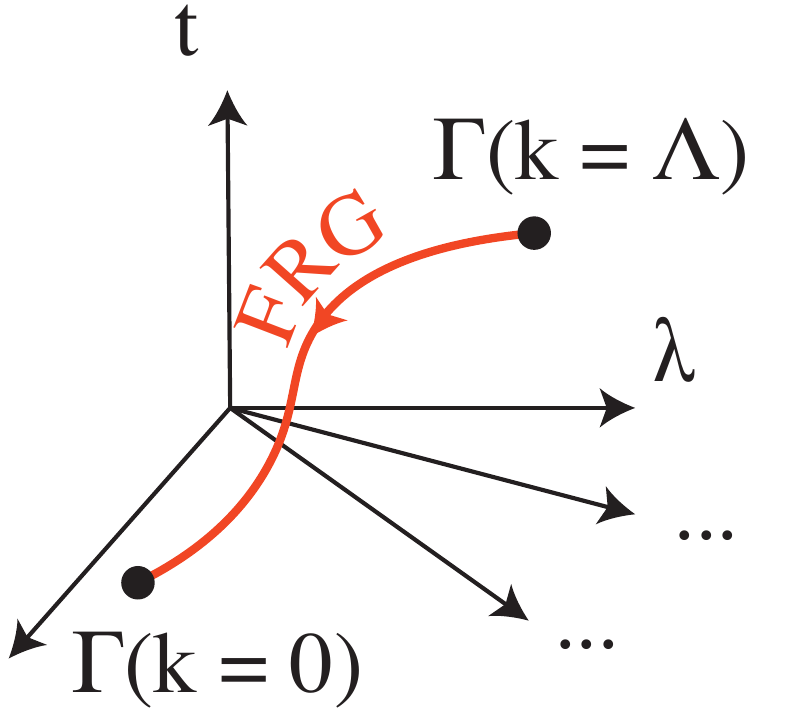

- Equation that does it: Functional Renormalization Group equation
  $$
  \partial_k \Gamma_{k}[\phi] = \frac{1}{2} {\rm STr} \Big[ \big( \Gamma^{(2)}_{k}[\phi] + R_k \big)^{-1} \cdot \partial_k R_k  \Big]
  $$

 Wetterich, 1993

**Pros:** Exact, non-perturbative, no sign problem. **Cons**: requires
truncation.

---

### Truncation: derivative expansion

- Near critical point: long wave excitations $\leadsto$ expansion around 
  uniform field

- First-order derivative expansion

  $$
  \begin{aligned}
       \notag
       \Gamma_k[\phi] = \int d^d x \left( U_k(\phi)  + \frac {1 } { 2 }  Z_k(\phi)  (\partial_i \phi)^2 \right)
       \end{aligned}
  $$

  - The average potential

  $$
  \begin{aligned}
           \partial_t U_k(\rho) &= \frac{1}{2} \int \bar d^dq   \partial_t R_k\left(q^2\right) \Big[G_k^\parallel+(N-1) G_k^\perp\Big], \quad \rho = \frac{\phi^2}{2}
       \end{aligned}
  $$

  with

  $$
  \begin{aligned}
       &G_k^{\perp} =  \frac{1}{Z_k^{\perp}(\rho)q^2 + U_k'(\rho) + R_k(q^2)}, \quad G_k^{\parallel} =  \frac{1}{Z_k^{\parallel}(\rho)q^2 + U_k'(\rho)+2\rho U_k''(\rho) + R_k(q^2)}.
       \end{aligned}
  $$

---

### Truncation: derivative expansion

Wave function renormalization:

$$
\begin{aligned}
 \partial_t Z_{\parallel}(\phi) &= \int \bar d^d q \partial_t R_k(q^2) \Bigg\\{ G_\parallel^2 \Big[ \gamma_\parallel^2 \big(G_\parallel' + 2 G_\parallel'' \frac{q^2}{d}\big) 2 \gamma_\parallel Z_\parallel'(\phi) \big(G_\parallel + 2 G_\parallel' \frac{q^2}{d}\big) \\\\
& + (Z_\parallel'(\phi))^2 G_\parallel \frac{q^2}{d} \frac12 Z''_\parallel(\phi) \Big]
\\\\ & + (N-1) G^2\_{\perp} \Big[ \gamma_\perp^2 \big(G_\perp' + 2 G_\perp'' \frac{q^2}{d}\big) 4 \gamma_\perp Z_\perp'(\phi)  G_\perp' \frac{q^2}{d} (Z_\perp'(\phi))^2 G_\perp \frac{q^2}{d}
\\\\ &+  2 \frac{Z_\parallel(\phi)-Z_\perp(\phi)}{\phi} \gamma_\perp G_\perp \frac12 \left(\frac{1}{\phi}Z'_\parallel(\phi) \frac{2}{\phi^2} (Z_\parallel-Z_\perp) \right) \Big] \Bigg\\}
\end{aligned}
$$

with
$
\gamma_\parallel = q^2 Z_\parallel'(\phi) + U^{(3)}(\phi),  \quad \gamma_\perp = q^2 Z_\perp'(\phi) + \frac{\partial}{\partial \phi} \left( \frac{1}{\phi}U' (\phi) \right), \quad G' = \frac{\partial G} {\partial q^2}, \ldots
$

G. Johnson, F. Rennecke, and V.S., Phys.Rev.D 107 (2023) 11,
116013

---

### Truncation: series expansion

- Taylor series expansion of $U_k(\phi)$ and $Z_k(\phi)$ (orders 12 and 6
  respectively)

  - Traditionally: expand near $k$-dependent minimum: $U_k'[\phi_k] = h =$
    const.

  - To locate YLE: expand near $U_k''[\phi_k] = m^2 \to 0$.

    $\leadsto$ $U_k'[\phi_k] = h_k \ne$ const

    $\leadsto$ Calculations in the broken phase are not feasible

- 18-26 coupled stiff differential equations

  - Mathematica to obtain equations (multiple Gb)

  - Implicit solvers for ODE's

  - Months on an HPC

---

### Results: importance of fluctuations ($N$=1)

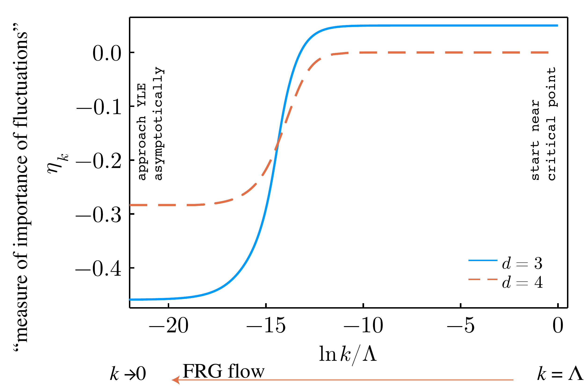

F. Rennecke and V. S, Annals Phys. 444 (2022) 169010

---

### Results: Ising universality class $N=1$

$d$ does not have to be integer in FRG

| d                                | 1   | 2          | 3        | 4           |
| -------------------------------- | --- | ---------- | -------- | ----------- |
| $ \| z_c \| /R\_\chi^{1/\gamma}$ | 1   | 1.32504(2) | 1.621(4) | $3/2^{2/3}$ |

G. Johnson, F. Rennecke, and V. S, Phys.Rev.D 107 (2023) 11,
116013  
F. Rennecke and V. S, Annals Phys. 444 (2022) 169010  
A. Connelly, G. Johnson, F. Rennecke, and V. S, Phys.Rev.Lett. 125 19, 191602
(2020)  
$d=2$: H.-L. Xu and A. Zamolodchikov, JHEP 08 (2022) 057 H.-L. Xu and A.
Zamolodchikov, 2304.07886

---

### Arbitrary $N$, $d=3$

| N                                | 1           | 2           | 3           | 4           | 5            |
| -------------------------------- | ----------- | ----------- | ----------- | ----------- | ------------ |
| $ \| z_c \| /R\_\chi^{1/\gamma}$ | 1.621(4)(1) | 1.612(9)(0) | 1.604(7)(0) | 1.597(3)(0) | 1.5925(2)(1) |

G. Johnson, F. Rennecke, and V. S, Phys.Rev.D 107 (2023) 11,
116013  
c.f. F. Karsch, C. Schmidt, and S. Singh Phys.Rev.D 109 (2024) 1, 014508

---

### Analytic structure in QCD: $T_c<T<T_{RW}$

---

### Analytic structure in QCD: $T\to T_c$

---

### Analytic structure in QCD: $T\to T_{RW}$

---
### Tracing YLE singularity: RW critical point 

Lattice QCD and indirect methods to locate YLE: 

input from  Im $\mu$  \& analytic continuation 

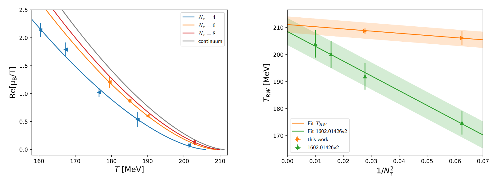

$$
  z = z_c \to \text{Re} \mu_{YLE} \propto (T_{RW}-T)^{\beta \delta} \quad \leadsto T_{RW} = 211.1 \pm 3.1 \text{MeV}.
$$

Christian Schmidt, et. al., 2401.07790

---
### Tracing YLE singularity: chiral critical point  

Lattice input from Taylor series coeff. at $\mu=0$ or  Im $\mu$  \&  analytic continuation 

G. Basar, 2312.06952  
D. Clarke et. al., 2405.10196

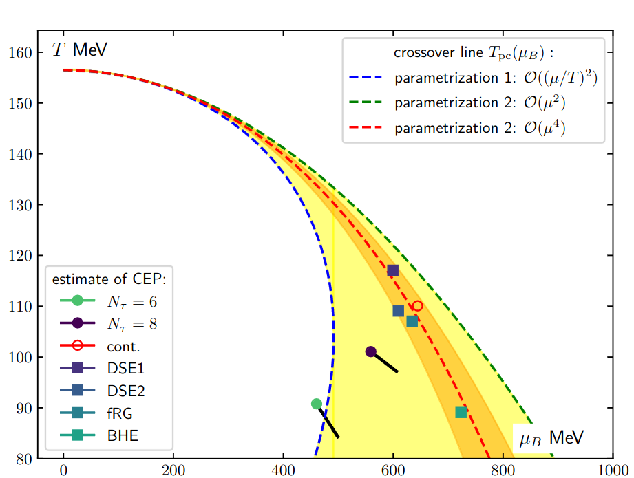

$$ z=z_c \to \text{Re} (\mu-\mu_c) = c_1 (T-T_c) + c_2 (T-T_c)^2  \text{ and }  \text{Im} \mu = c_3 (T-T_c)^{\beta\delta}
$$
$$
\leadsto 
T_c \approx 110 \text{ MeV} , \mu_c \approx 650 \text{ MeV}$$ 

---

### Taking it further 

- Properties of YLE, e.g. $\sigma_{\rm YLE}$ can be use to validate indirect
  methods of locating YLE in QCD, e.g. volume scaling of the density of zeros

- Moreover,

  - YLE defines the behavior of the higher order Taylor expansion coefficients
    (Darboux's theorem). E.g. for of $f_G(z)$:

    

    $$
    f_G^{(n)} \sim 2 B_0 {\red{|z_c|}}^{-n} \frac{n^{ \red \sigma -1 }}{\Gamma(\red \sigma  )}  \cos \left(\beta_0 - {\red{\frac{\pi n}{2\beta \delta}}  } \right),
    \quad B_0 \exp (i \beta_0) = \lim\limits_{z\to z_c}  \frac{ f_G(z)-f_G(z_c)}
    {(1-z/z_c)^{\sigma} }
    $$

  - Fourier coefficients are exponentially sensetive to YLE

    $$
    b_{k\gg1} \approx \|\tilde A_{\rm YLE}\| \frac{e^{-\hat \mu_r^{\rm YLE} k }}{k^{1+\sigma}} \cos(\hat \mu_i^{\rm YLE} k + \phi^{\rm YLE}_a)
    $$

$$
     +\|\hat A_{\rm RW}\|  (-1)^k \frac{e^{-\hat \mu_r^{\rm RW} k }}{k^{1+\sigma}}
    $$

 M. Bryant, C. Schmidt, V. S., 2401.06489 

---

### Fourier coefficients

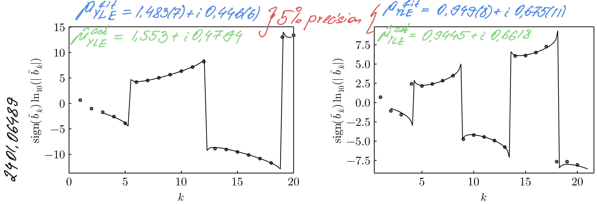

 M. Bryant, C. Schmidt, V. S., 2401.06489 

---

### Conclusions

- Universal location of YLE was one of not many unknown universal quantities
  - FRG allowed us to find the universal location of YLE for $d>2.7$ and
    arbitrary $N$
  - Xu and Zamolodchikov determined location of YLE in Ising Field Theory, $d=2$
    and $N=1$
- To map universal location to QCD, one requires non-universal metric factors.
  They are generically not known.
- Nevertheless properties of YLE singularities might be useful in establishing
  existence/location of QCD critical point
  - YLE is continuously connected to critical point; 
  - Two distinct approaches based on lattice input from Taylor coefficients and imaginary $\mu$ $\leadsto$ approximately the same $T_c$; more checks: $\sigma_{\rm YLE}$ is universal and independent of $N$; it
    predicts the behaviour of Lee-Yang zeroes and their scaling with volume
  - Associated analytic structure of complex $\mu$-plane constraints the
    behaviour of Fourier coefficients
