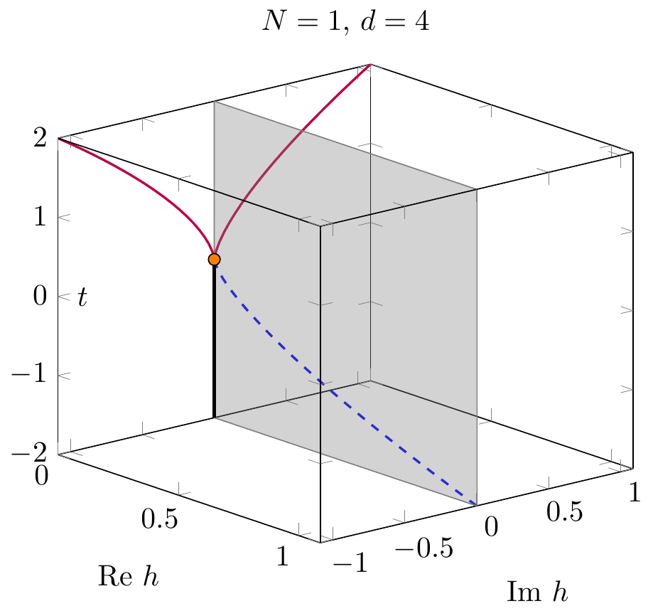
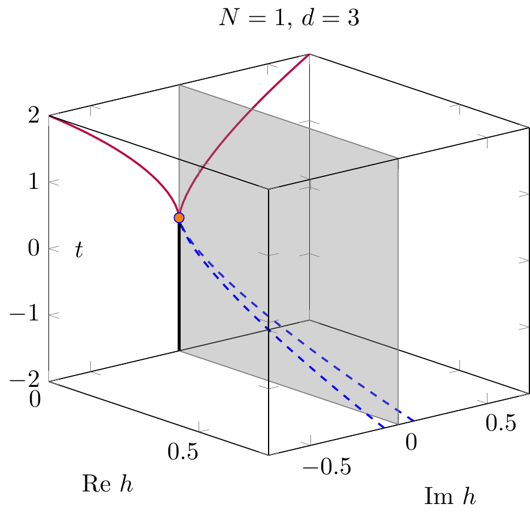
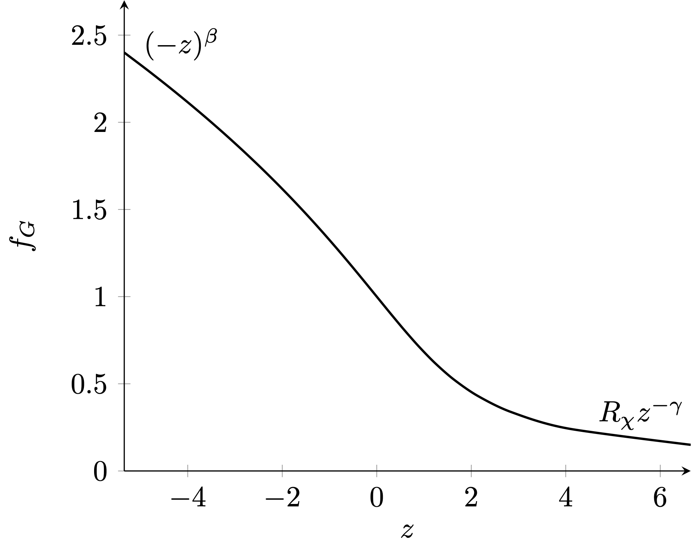
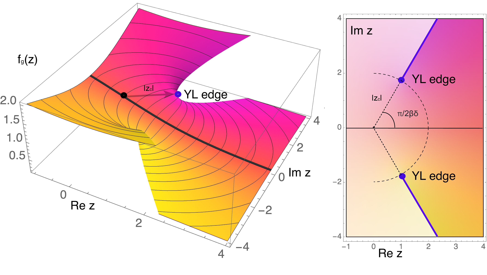
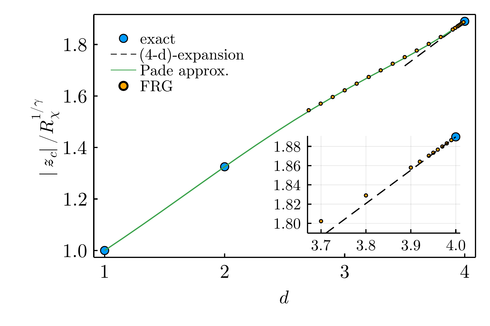
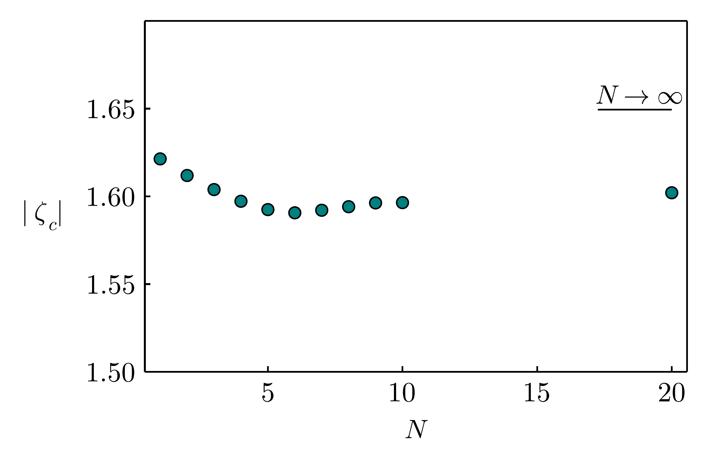
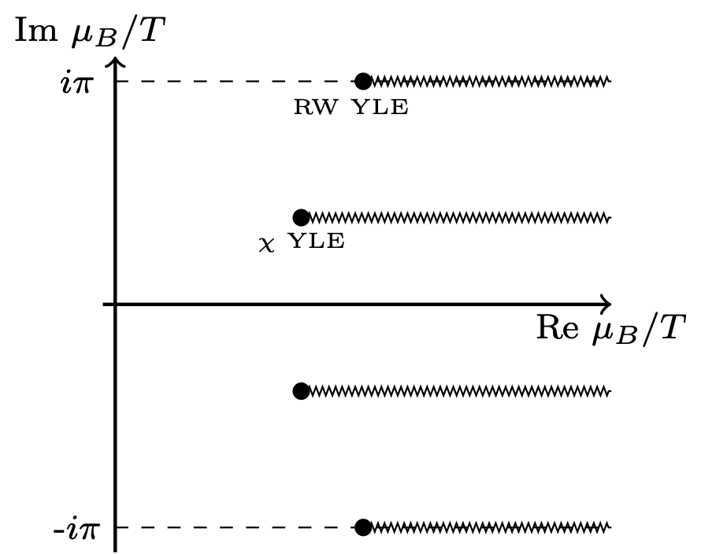
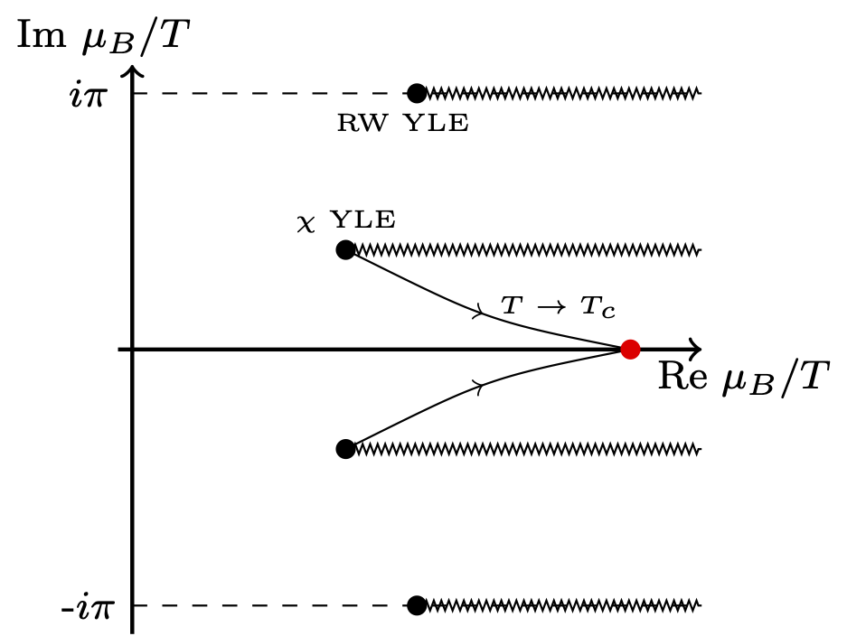
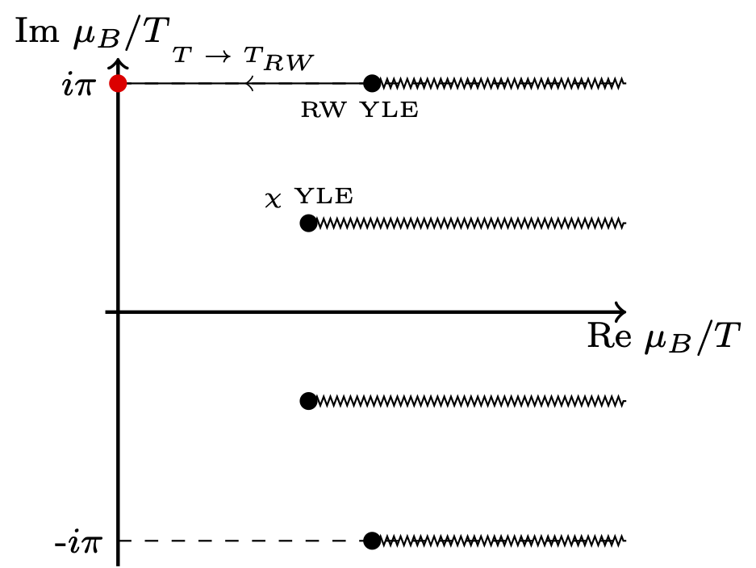

# Yang-Lee edge singularity 

# with Functional RG 

Vladi Skokov

North Carolina state University

---

### Phase diagram of Ising model near critical point  

F. Rennecke, G. Johnson, and V.S.,     Phys.Rev.D 107 (2023) 11, 116013

- All curves in this plot are defined by zero mass of order parameter    
- YLEs: solid   red lines ; Their continuation to $t<0$, spinodals:   dashed blue line(s) 

---

### Motivation to study YLE singularities:  
### they are continuously connected to 
### the critical point 

---

### Do YLEs always connect to finite $T$ crit. points? 

Counter example: one dimensional Ising model ($\hat h = h/T$, $\hat J = J /T$) 

$$ 
      f = - \lim_{L\to \infty} \frac{T}{L} \ln Z = -  T \ln \left( e^{\hat J} \cosh(\hat h) + \sqrt{ e^{2\hat J} \sinh^2(\hat h) + e^{-2\hat J}  } \right), 
$$ 

with YLE (zero mass) at 

$$
    h_c = \pm i T \arcsin e^{-2\hat J}
$$

Two YLEs pinch the real $h$ axis at $T=0$ 

* YLEs connect to a critical point, but not always at non-zero $T$ 

---

### Second-order phase transition:  Landau model

- To set up the stage, introduce  notation and relevant concepts, best to consider Landau model 

`\[ F = \int d^{d} x \left(  \frac{1}{2} {\color{red} t} \phi^2 + \frac{1}{4}  \lambda \phi^4 - {\color{blue} h} \phi   \right) \]`

E.g.: 

- near chiral limit: ${\color{red} t} \propto T-T_c + \kappa \mu^2$, ${\color{blue} h}\propto m_{u,d}$
- near CP: ${\color{red}t},{\color{blue}h} \propto \alpha_{t,h}(T-T_c) + \beta_{t,h} (\mu-\mu_c)$
- near RW: ${\color{red}t} \propto T-T_{RW}$, ${\color{blue}h}\propto \mu_B - i \pi T$

---

### Magnetic equation of state

`\[ F = \int d^{d} x \left(  \frac{1}{2} t \phi^2 + \frac{1}{4}  \lambda \phi^4 - h \phi   \right) \]`

Minimize $F[\phi]$ $\leadsto$ equilibrium order parameter:

- Arbitrary $t$ and $h$: $t \phi + \lambda \phi^3 = h$
- Simplify: $\lambda\to1$: $t \phi + \phi^3 = h$
- Ansatz for the solution $\phi = h^{1/3} {\color{Emerald}f_G}$

$t h^{1/3} {\color{Emerald}f_G}  + h {\color{Emerald}f_G}^3 = h$ or
${ \color{red}{\frac{t}{ h^{2/3}}} } {\color{Emerald}f_G}  + {\color{Emerald}f_G}^3 = 1$

- Scaling form of ${\color{Emerald} \text{magnetic equation of state}}$ ($\beta = 1/2, \delta=3$)
  $${\color{Emerald} f_G} ( {\color{red}{z}}  + {\color{Emerald}f_G}^2) = 1, \quad {\color{red}{ z  =  {\frac{t}{ h^{\frac1{\beta \delta}} }} } }$$

---

### Yang-Lee edge singularity

---

### Near YLE singularity:  $\frac{\partial^2 F}{\partial \phi^2} = 0 $

- $f_G$ is singular
  $$f_G - f_G^c \propto (z-z_c)^{\color{red}{\sigma_{\rm YLE}}} $$

- Critical exponent ${\color{red}{\sigma_{\rm YLE}}}$ is independent of the
  underlying universality class (for O(N), $\sigma_{\rm YLE}$ is $N$-independent); superuniversality 

- From conformal bootrstrap, $\color{red}{\sigma^{d=3}_{\rm YLE}} = 0.085(1)$

- Mean-field approximation gets it wrong:
  ${\sigma^{\rm MF}_{\rm YLE}} = \frac12$

- Mean-field approximation also does not get correct $z_c$   

- $z_c$ is universal: for $O(N)$, $z_c$ depends only on $N$ and $d$

---

### Universal location of YLE

- The phase of $z_c = |z_c| e^{\pm \frac{i \pi}{2 \beta \delta}}$ is defined by
  the critical exponents of the underlying universality class.  

- How to determine $|z_c|$?  

- Ordinary, two methods: 

  - $\varepsilon$-expansion 

  - lattice
  
  - both of them fail 

---

### FRG ✅ 

- No sign problem 
- Non-perturbative 
- Working near second-order critical point $\leadsto$ justified truncation scheme 
- Validated by computing critical exponents and amplitude ratios

| $N=1, d=3$  | $\nu$        | $\eta$ |
| --- | ---------- | -- |            
|FRG|0.63012(16)   | 0.0361(11) | 
|CB|         0.629971(4)      | 0.0362978(20) |

 G. De Polsi, I. Balog, M. Tissier, N. Wschebor, 2001.07525   

 G. De Polsi, G. Hernández-Chifflet, N. Wschebor, 2109.14731   

- As a bonus: calculations are possible at any $d$ and $N$ (including non-integer). 

---

### Results: Ising universality class $N=1$

$d$ does not have to be integer in FRG

| d                                | 1   | 2          | 3        | 4           |
| -------------------------------- | --- | ---------- | -------- | ----------- |
| $ \| z_c \| /R\_\chi^{1/\gamma} (N_{trunc})$ | 1   | 1.32504(2) | 1.621(4) | $3/2^{2/3}$ |

G. Johnson, F. Rennecke, and V. S, Phys.Rev.D 107 (2023) 11,
116013  
F. Rennecke and V. S, Annals Phys. 444 (2022) 169010  
A. Connelly, G. Johnson, F. Rennecke, and V. S, Phys.Rev.Lett. 125 19, 191602
(2020)  
$d=2$: H.-L. Xu and A. Zamolodchikov, JHEP 08 (2022) 057 H.-L. Xu and A.
Zamolodchikov, 2304.07886

---

### Arbitrary $N$, $d=3$

| N                                | 1           | 2           | 3           | 4           | 
| -------------------------------- | ----------- | ----------- | ----------- | ----------- |
| $ \| z_c \| /R\_\chi^{1/\gamma} (N_{trunc}) (N_{reg})$ | 1.621(4)(1) | 1.612(9)(0) | 1.604(7)(0) | 1.597(3)(0)  |

G. Johnson, F. Rennecke, and V. S, Phys.Rev.D 107 (2023) 11,
116013  
c.f. F. Karsch, C. Schmidt, and S. Singh Phys.Rev.D 109 (2024) 1, 014508

---

### Analytic structure in QCD: $T_c<T<T_{RW}$

---

### Analytic structure in QCD: $T\to T_c$

---

### Analytic structure in QCD: $T\to T_{RW}$

---

### Conclusions

- Second order phase transition comes with Yang-Lee edge singularity. In the "crossover" region, there is a singularity in the complex plane
- Universal location of YLE was one of not many unknown universal quantities
  - With FRG, we succeeded  to compute the location of YLE for $d>2.7$ and arbitrary $N$ 
  - Xu and Zamolodchikov determined location of YLE in Ising Field Theory, $d=2$
    and $N=1$
- To map universal location to QCD, one requires non-universal metric factors.
  They are generically are not known
- Nevertheless properties of YLE singularities might be useful in establishing
  existence/location of QCD critical point
  - YLE is continuously connected to critical point 
